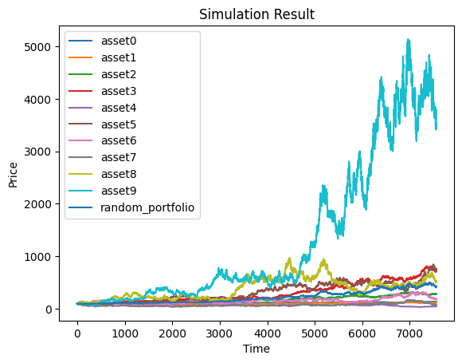
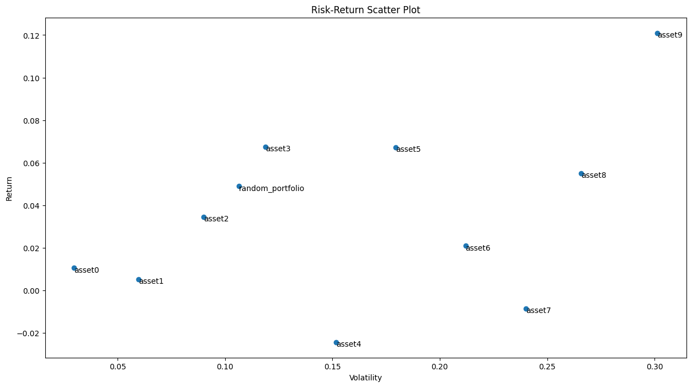
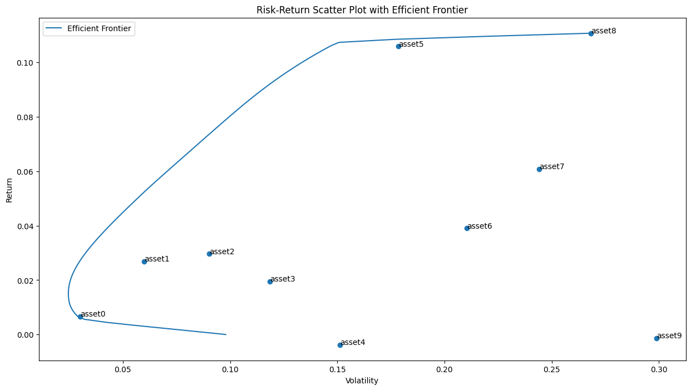
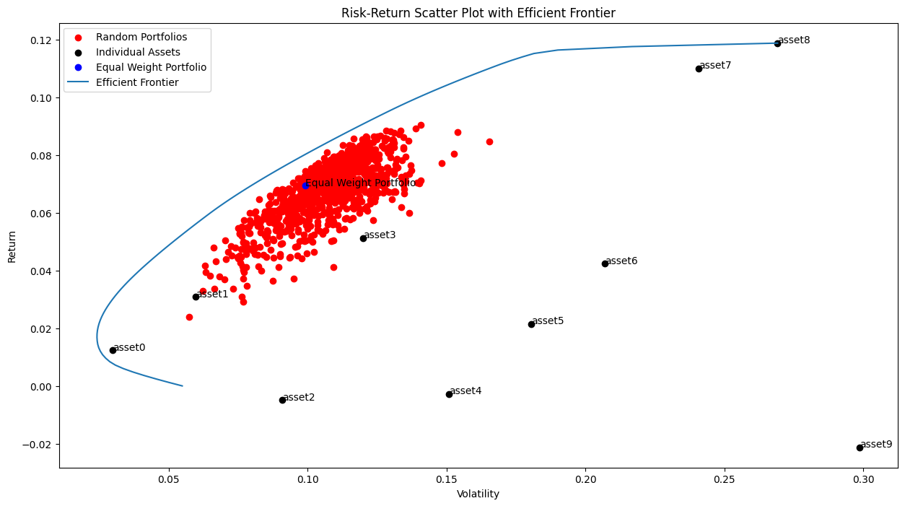
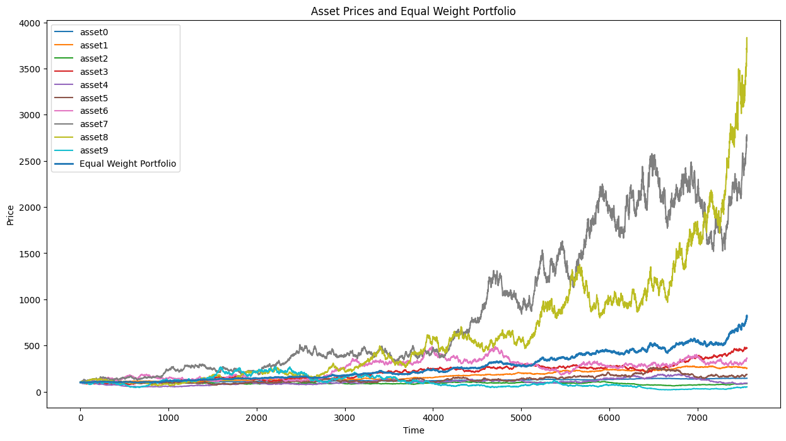

## Stock Price Simulation with Geometric Brownian Motion and Efficient Frontier

A quick experiment with stock portfolio price simulation using Geometric Brownian Motion and Efficient Frontier.

### Stock Price Simulation

The experiment unequivocally assumes stock prices adhere to [Geometric Brownian Motion](https://en.wikipedia.org/wiki/Geometric_Brownian_motion). Under this assumption, the stock price random variable is as follows.

$$
S = S_0 \exp \left( \left( \mu - \frac{\sigma^2}{2} \right) t + \sigma W_t \right)
$$

Here, $S_0$ is the initial stock price, $\mu$ is the average rate of return, $\sigma$ is volatility, $W_t$ is a random variable with Brownian motion. Also, the random variable of Brownian motion $W_t$ is a normal distribution $N(0,t)$.

I simulated it using [Python](./stock_price_simulation.ipynb). The code simulates the stock prices of 10 assets (i = 0, ..., 9) using Geometric Brownian Motion. Each asset has the following parameters:

- Expected return rate: 1 * (i + 1) % per year
- Volatility: 3 * (i + 1) % per year
- Initial stock price: 100 Pound Sterling (GBP)
- Time step: 1 day (dt = 1 / 252, assuming 252 trading days in a year)
- Simulation period: 30 years

The code generates asset parameters for each asset using the `generate_asset_params` function, which takes the number of assets, base expected return, and base volatility as inputs. It then simulates the stock prices for each asset using the `GeometricBrownianMotion` class and the `simulate_assets` function.

The `GeometricBrownianMotion` class encapsulates the simulation logic and provides a `simulate` method to perform the simulation and return the results as a DataFrame.

The `simulate_assets` function simulates multiple assets using the `GeometricBrownianMotion` class and returns a DataFrame containing the price paths of all assets.

Finally, the `main` function sets the base values for expected return (1%) and volatility (3%), generates asset parameters for 10 assets, simulates the stock prices, and plots the results using a line plot.



The plot shows the simulated stock price paths for each asset over 30 years, with the x-axis representing time steps (days) and the y-axis representing the stock price in British Pound Sterling. The different coloured lines correspond to other assets, each with its expected return and volatility based on the asset index.

The simulated stock prices exhibit exponential growth over time, with higher-indexed assets (e.g., asset9) having steeper growth curves due to higher expected returns and volatilities. The stock prices also show random fluctuations due to the stochastic nature of the Geometric Brownian Motion model.

> The random seed is set to 42 using `np.random.seed(42)` to ensure reproducibility of the simulation results.

### Risk and Return

I calculated the risk and return of the stock price data. First, I defined the logarithmic rate of return.

$$X_t = \log S_t / S_{t-1}$$

$X_t$ represents the annual logarithmic rate of return. I converted the average to a yearly rate to calculate it. Denoted the annual volatility by $X_t$. Finally, I converted the standard deviation to an annual rate to calculate it.

```sh
asset0:
Annual return: 1.05%
Annual volatility: 2.98%

asset1:
Annual return: 0.51%
Annual volatility: 5.98%

asset2:
Annual return: 3.46%
Annual volatility: 9.00%

asset3:
Annual return: 6.74%
Annual volatility: 11.89%

asset4:
Annual return: -2.44%
Annual volatility: 15.18%

asset5:
Annual return: 6.73%
Annual volatility: 17.95%

asset6:
...
```

asset0:
- Annual return: 1.05%
- Annual volatility: 2.98%

By the way, the random variable is $X$ with an expected value of $\mu - \frac{\sigma^2}{2}$. I calculated the annual logarithmic rate of return by ignoring this part. In other words, the average yearly logarithmic rate of return is $m$. If it is the same value, it means it is approximate. The approximation is $p$, which is accurate when it is small.

For asset0, the annual return is 1.05%, which aligns closely with the expected return parameter ($\mu$) of 1% meticulously used in the simulation. Similarly, the annual volatility of 2.98% mirrors the volatility parameter ($\sigma$) of 3%.

asset9:
- Annual return: 12.09%
- Annual volatility: 30.13%

For asset9, the annual return is 12.09%, close to the expected return parameter ($\mu$) of 10% (1% * 10) used in the simulation. The annual volatility is 30.13%, close to the volatility parameter ($\sigma$) of 30% (3% * 10) for asset9.

Observation

The annual return and volatility increase as the asset index increases from 0 to 9. The asset index determines the simulation parameters for each asset. I calculated the expected return and volatility for each asset as follows:

- Expected return: 1% * (i + 1), where i is the asset index
- Volatility: 3% * (i + 1), where i is the asset index

Therefore, higher-indexed assets have higher expected returns and volatilities, resulting in higher annual returns and volatilities in the simulation results.

The approximation is valid for this stock price data because the volatility parameter ($\sigma$) is small for each asset. As a result, ignoring the $- \frac{\sigma^2}{2}$ term in the expected logarithmic rate of return calculation provides an accurate approximation of the annual logarithmic rate of return.


### Random Portfolio

Subsequently, I created a random portfolio and calculated its risk and return. In this portfolio, I randomly distributed assets worth 100 Pound Sterling (GBP).



```sh
Random Portfolio:
Annual return: 4.89%
Annual volatility: 10.65%
```

The random portfolio has the average return of all stocks and the lowest volatility. Investors generally believe lower risk is better if they want the same return. Therefore, the portfolio in the upper left corner of this graph can be said to be a good portfolio. This random portfolio is in a relatively good position.

### Efficient Frontier

So far, plotting the relationship between risk and return allows me to judge whether each investment strategy is good or bad. I also calculated the risk and return of a random portfolio.

When investing, you want to minimise risk in return for the same return. Therefore, we look for a portfolio minimising the risk required for a specific return. Such a portfolio is called an efficient portfolio. The [efficient frontier](https://en.wikipedia.org/wiki/Efficient_frontier) is the relationship between risk and return of an [efficient portfolio](./efficient_frontier.ipynb).



By investing in a portfolio using an efficient frontier, you can invest whilst minimising risk.

### Equal Weight Portfolio

From the previous analysis, I discovered selecting an efficient portfolio can help obtain profits with minimal risk. However, there is a problem with it. It is not possible to know future returns or volatility when investing. Future portfolios use past data, but no guarantee exists they will be efficient.

Institutional investors can estimate their risks and returns by analysing various information and investing in efficient portfolios. However, it is difficult for retail investors to perform such information analysis. Therefore, I created a portfolio using a relatively simple method called an equal-weight portfolio. An [equal-weighted portfolio](./equal_weight_portfolio.ipynb) invests in an equal number of stocks. Now, let's compare the random portfolio and this equal-weighted portfolio.



Here are some insights:

- **Efficient Frontier:** The blue curve represents the efficient frontier, indicating the optimal portfolios offering the highest expected return for a given level of risk.

- **Random Portfolios:** The red dots scattered across the graph represent various randomly generated portfolios. Most of these portfolios cluster around a central region, but none lie on the efficient frontier, indicating suboptimal risk-return profiles.

- **Individual Assets:** The black dots represent individual assets. The positioning of these assets reveals their standalone risk and return characteristics.

- **Equal Weight Portfolio:** The blue dot marks the equal-weight portfolio, showing its specific return and volatility. It lies within the cluster of random portfolios but not on the efficient frontier, indicating it could be more optimal regarding risk-return trade-off.



It offers insights into the price movements of individual assets and the equal-weight portfolio over time:

- **Asset Price Trends:** illustrates the price trajectories of ten individual assets. Some assets, like asset7 and asset8, show significant price appreciation, whilst others exhibit more modest growth.

- **Equal Weight Portfolio:** The light blue line represents the equal weight portfolio's price trend. It follows a steady upward trajectory, indicating diversified growth but less steep than the highest-performing individual assets.

- **Volatility:** The varying slopes and fluctuations of individual asset lines suggest different levels of volatility, with some assets exhibiting sharp price swings and others displaying more stable growth.

The Equal Weight Portfolio collectively highlight the trade-offs between individual asset performance, portfolio diversification, and the quest for an optimal risk-return balance.

### Summary

Through the experiment, I was able to optimise a stock portfolio and draw an efficient frontier. In addition, I created random and equal-weighted portfolios, which I then compared with the efficient frontier. The findings were clear and consistent. Buying a random portfolio was found to significantly reduce risk compared to buying stocks individually. Similarly, choosing an equal-weighted portfolio led to a selection remarkably close to the efficient frontier. These results instil confidence in the effectiveness of these strategies for stock portfolio optimisation.

If you are still deciding what to buy as an investment, remember to consider all the options presented to you with equal weight.

### License

This project is licensed under the [Apache License 2.0](./LICENSE).

### Citation

```tex
@misc{afosps2024,
  author       = {Oketunji, A.F.},
  title        = {Stock Price Simulation with Geometric Brownian Motion and Efficient Frontier},
  year         = 2024,
  version      = {0.0.1},
  publisher    = {Zenodo},
  doi          = {10.5281/zenodo.11414508},
  url          = {https://doi.org/10.5281/zenodo.11414508}
}
```

### Copyright

(c) 2024 [Finbarrs Oketunji](https://finbarrs.eu). All Rights Reserved.
